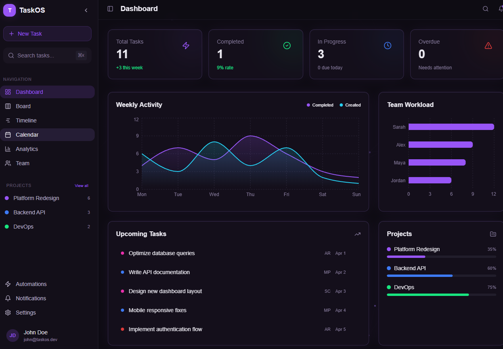
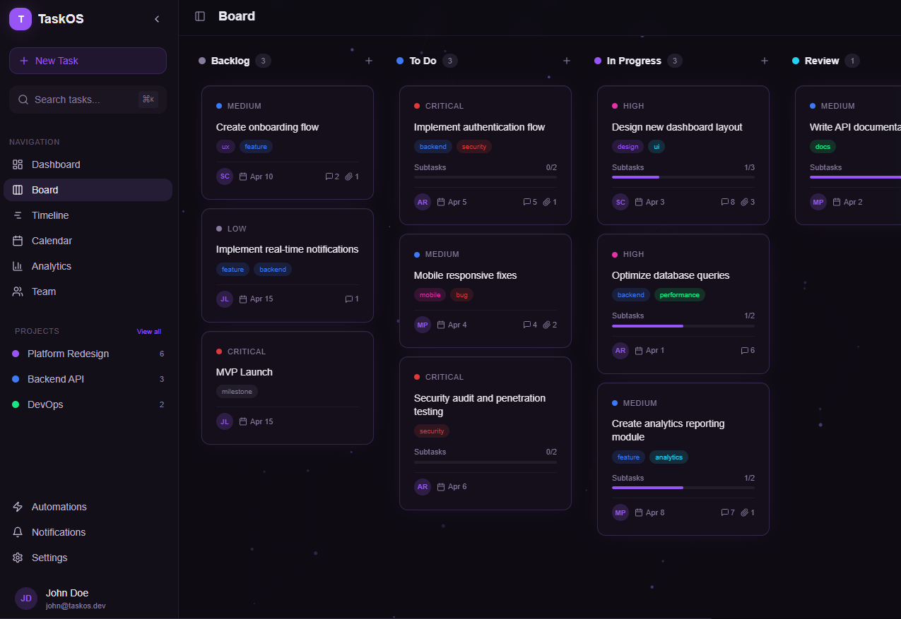
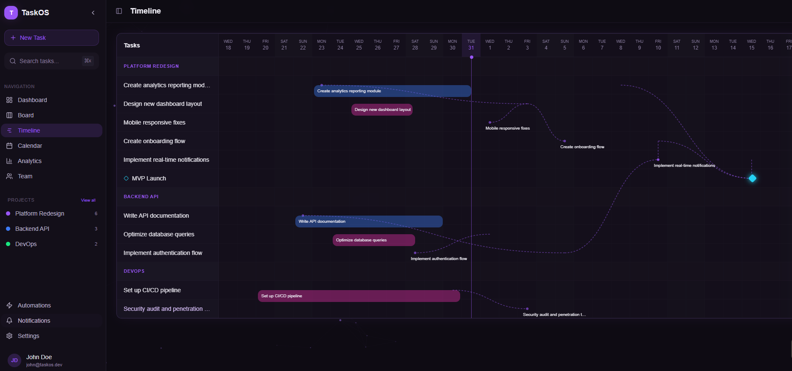
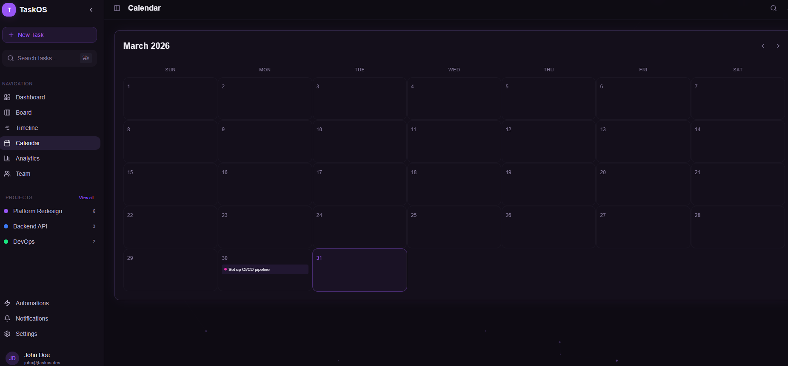
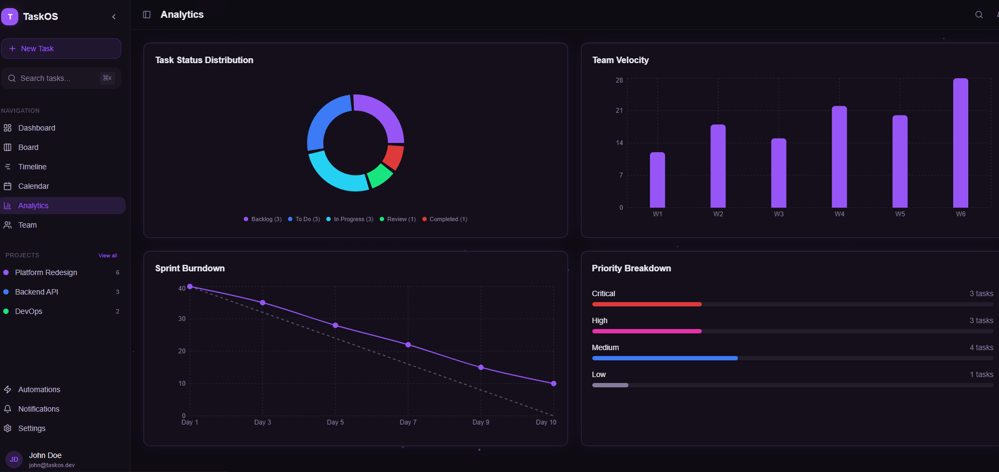
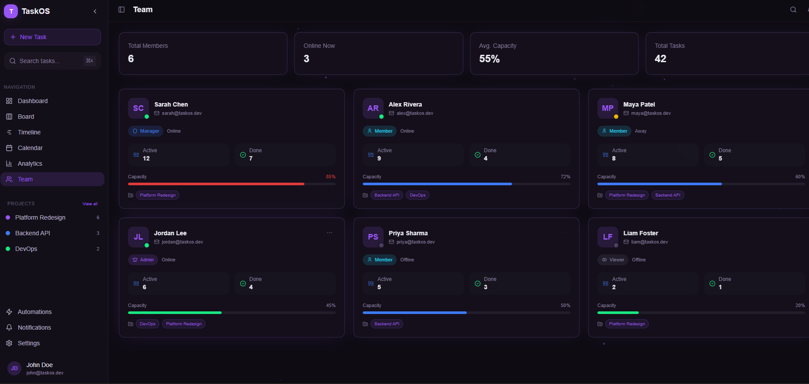
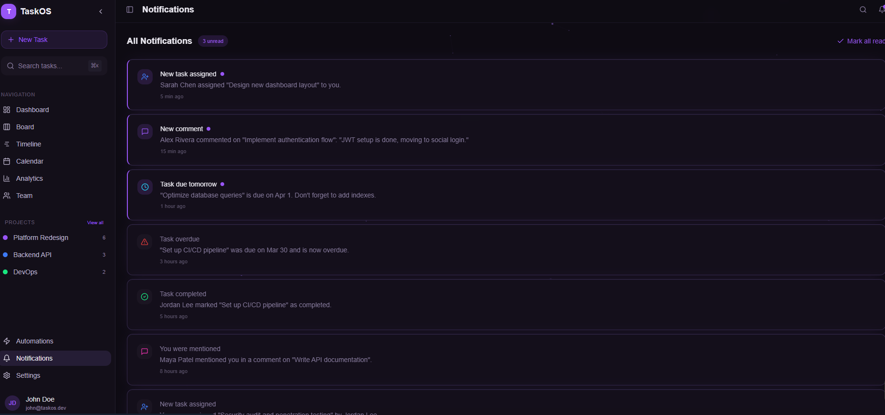
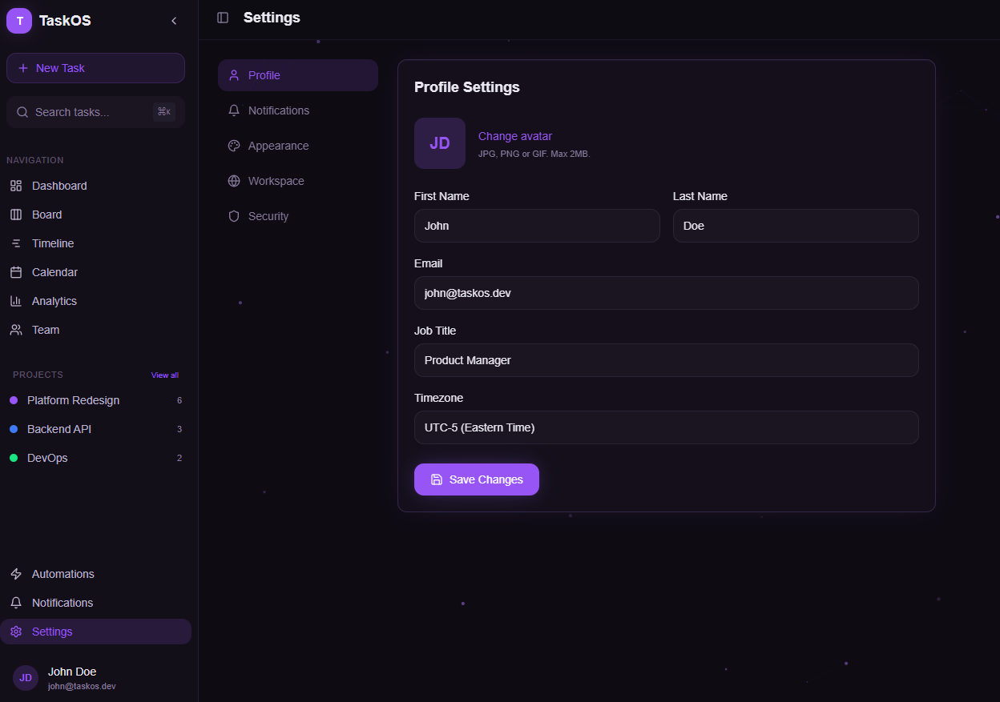

# 🚀 TaskOS - Advanced Task Management System

**Orchestrate Your Workflow with Precision**

[](https://react.dev)
[](https://www.typescriptlang.org)
[](https://tailwindcss.com)
[](https://www.framer.com/motion)
[](https://vitejs.dev)

A **next-generation task management platform** built for modern teams who demand clarity, control, and collaboration. TaskOS combines powerful project tracking with an intuitive interface, enabling teams to ship faster while staying aligned.

---

## ✨ Features

### 📊 For Teams
- **Interactive Kanban Board** — Drag-and-drop tasks across customizable workflows
- **Gantt-Style Timeline** — Visualize project schedules with dependencies and milestones
- **Team Capacity Planning** — Monitor workload distribution and availability
- **Real-Time Collaboration** — Comments, mentions, and activity notifications
- **Smart Automation Rules** — Auto-assign tasks, escalate overdue items, and trigger actions

### 🎯 For Managers
- **Executive Dashboard** — KPIs, velocity charts, and burndown tracking
- **Analytics & Reporting** — Status distribution, priority breakdown, team performance
- **Project Portfolio View** — Track progress across multiple projects simultaneously
- **Resource Allocation** — See who's overloaded and who has capacity
- **Customizable Workflows** — Adapt statuses and processes to your team's needs

### 🛠️ For Individuals
- **Personal Task Hub** — See all your assignments in one place
- **Calendar Integration** — Visualize deadlines and plan your week
- **Focus Mode** — Filter tasks by priority, project, or due date
- **Subtask Checklists** — Break down complex work into manageable steps
- **Quick Task Creation** — Capture ideas and assignments in seconds (`⌘K`)

### 🌟 Advanced Capabilities
- **Task Dependencies** — Link tasks and visualize critical paths
- **Milestone Tracking** — Mark key deliverables and achievements
- **Label System** — Tag tasks by category, technology, or custom criteria
- **File Attachments** — Keep all context attached to tasks
- **Dark Mode First** — Beautiful, eye-friendly interface with neon accents

---

## 📸 Screenshots

### 🏠 Dashboard
*Executive overview with KPIs, weekly activity charts, team workload, and upcoming tasks*



### 📋 Kanban Board
*Drag-and-drop task management with priority indicators, assignee avatars, and progress tracking*



### 📅 Timeline (Gantt)
*Project timeline with task dependencies, milestones, and team allocation*



### 📆 Calendar
*Monthly calendar view with task deadlines and priority indicators*



### 📊 Analytics
*Comprehensive charts: status distribution, velocity tracking, burndown, and priority breakdown*



### 👥 Team Management
*Team member cards with capacity tracking, role badges, and project assignments*



### 🔔 Notifications
*Real-time activity feed for assignments, comments, mentions, and due date reminders*



### ⚙️ Settings
*Customize profile, notifications, appearance, workspace, and security settings*



---

## 🏗️ Tech Stack

| Layer | Technology |
|-------|------------|
| **Framework** | React 18.3 + TypeScript 5.8 |
| **Build Tool** | Vite 5.4 |
| **Styling** | Tailwind CSS 3.4 + shadcn/ui |
| **Animation** | Framer Motion 12.38 |
| **Charts** | Recharts 2.15 |
| **Routing** | React Router 6.30 |
| **State** | Zustand 5.0 + React Query 5.83 |
| **Drag & Drop** | dnd-kit 6.3 |
| **Icons** | Lucide React 0.462 |
| **Forms** | React Hook Form 7.61 + Zod 3.25 |

---

## 🚀 Getting Started

### Prerequisites
- Node.js 18+ and npm/bun
- Modern browser (Chrome, Firefox, Edge, Safari)

### Installation

```bash
# Clone the repository
git clone https://github.com/your-username/taskos.git
cd taskos

# Install dependencies
npm install

# Start the development server
npm run dev
```

Open **http://localhost:5173** to view the app.

### Available Scripts

| Command | Description |
|---------|-------------|
| `npm run dev` | Start development server (Vite) |
| `npm run build` | Build for production |
| `npm run build:dev` | Build in development mode |
| `npm run preview` | Preview production build |
| `npm run lint` | Run ESLint |
| `npm run test` | Run Vitest tests |
| `npm run test:watch` | Run tests in watch mode |

---

## 📁 Project Structure

```
src/
├── components/
│   ├── ui/              # shadcn/ui primitive components (50+ files)
│   ├── layout/
│   │   ├── AppLayout.tsx        # Main app shell with sidebar
│   │   └── AppSidebar.tsx       # Collapsible navigation sidebar
│   ├── TaskCard.tsx             # Draggable task card component
│   ├── TaskDetailDrawer.tsx     # Task detail side panel
│   ├── CreateTaskModal.tsx      # New task creation modal
│   ├── KPICard.tsx              # Dashboard KPI display
│   └── NavLink.tsx              # Active state navigation links
├── pages/
│   ├── Dashboard.tsx            # Main dashboard with charts
│   ├── Board.tsx                # Kanban board view
│   ├── Timeline.tsx             # Gantt chart timeline
│   ├── CalendarPage.tsx         # Monthly calendar
│   ├── Analytics.tsx            # Charts and metrics
│   ├── Team.tsx                 # Team management
│   ├── Projects.tsx             # Project portfolio
│   ├── ProjectDetail.tsx        # Single project view
│   ├── Automations.tsx          # Automation rules
│   ├── Notifications.tsx        # Activity feed
│   └── SettingsPage.tsx         # User settings
├── store/
│   └── taskStore.ts             # Zustand state management
├── hooks/
│   ├── use-mobile.tsx           # Mobile detection hook
│   └── use-toast.ts             # Toast notification hook
└── lib/
    └── utils.ts                 # Utility functions (cn helper)
```

---

## 🎨 Design System

### Color Palette
- **Primary:** `hsl(265, 90%, 65%)` — Neon Purple
- **Secondary:** `hsl(220, 90%, 60%)` — Electric Blue
- **Accent:** `hsl(190, 90%, 55%)` — Cyan
- **Success:** `hsl(150, 80%, 50%)` — Neon Green
- **Warning:** `hsl(320, 80%, 55%)` — Magenta
- **Danger:** `hsl(0, 72%, 55%)` — Red

### Typography
- **Headings:** Plus Jakarta Sans (font-display)
- **Body:** Inter (font-sans)

### Visual Effects
- **Glassmorphism** — Backdrop blur panels with subtle borders
- **Neon Glow** — Accent glows on buttons and active states
- **Smooth Transitions** — Framer Motion page and hover animations
- **Particle Background** — Floating ambient particles (toggleable)

---

## 📦 Core Data Models

### Task
```typescript
interface Task {
  id: string;
  title: string;
  description: string;
  status: 'backlog' | 'todo' | 'in_progress' | 'review' | 'completed';
  priority: 'critical' | 'high' | 'medium' | 'low';
  assignee: string;
  project: string;
  labels: string[];
  startDate: string;
  dueDate: string;
  subtasks: { id: string; title: string; done: boolean }[];
  dependencies: string[];
  isMilestone: boolean;
}
```

### Team Member
```typescript
interface TeamMember {
  id: string;
  name: string;
  role: 'admin' | 'manager' | 'member' | 'viewer';
  email: string;
  taskCount: number;
  completedTasks: number;
  capacity: number; // 0-100
  status: 'online' | 'away' | 'offline';
  projects: string[];
}
```

---

## 🔌 Key Integrations (Roadmap)

- **Backend API** — REST/GraphQL for data persistence
- **Authentication** — OAuth 2.0 (Google, GitHub, Microsoft)
- **Real-Time Sync** — WebSocket for live collaboration
- **Cloud Storage** — S3/Cloudflare R2 for attachments
- **Email Service** — SendGrid/Resend for notifications
- **Calendar Sync** — Google Calendar, Outlook integration
- **Slack/Discord** — Team notifications and bot commands

---

## 🗺️ Roadmap

### Q2 2026
- [ ] Backend API with PostgreSQL database
- [ ] User authentication and authorization
- [ ] Real-time collaboration with WebSockets
- [ ] File upload and attachment management
- [ ] Email notifications and digests

### Q3 2026
- [ ] Mobile app (React Native)
- [ ] Advanced filtering and saved views
- [ ] Custom workflow builder
- [ ] Time tracking and estimates
- [ ] Recurring tasks and templates

### Q4 2026
- [ ] AI-powered task suggestions
- [ ] Natural language task creation
- [ ] Advanced reporting and exports
- [ ] Integration marketplace
- [ ] Multi-language support (i18n)

---

## 🧪 Testing

```bash
# Run all tests
npm run test

# Run tests in watch mode
npm run test:watch

# Run E2E tests with Playwright
npx playwright test
```

---

## 📄 License

MIT License — see [LICENSE](./LICENSE) for details.

---

## 🤝 Contributing

1. Fork the repository
2. Create your feature branch (`git checkout -b feature/amazing-feature`)
3. Commit your changes (`git commit -m 'Add amazing feature'`)
4. Push to the branch (`git push origin feature/amazing-feature`)
5. Open a Pull Request

---

## 💬 Support

- **Documentation:** [docs.taskos.dev](https://docs.taskos.dev)
- **Issues:** [GitHub Issues](https://github.com/your-username/taskos/issues)
- **Discussions:** [GitHub Discussions](https://github.com/your-username/taskos/discussions)

---

## 🙏 Acknowledgments

Built with:
- [shadcn/ui](https://ui.shadcn.com) — Beautiful UI components
- [Lucide Icons](https://lucide.dev) — Clean, consistent icons
- [Framer Motion](https://www.framer.com/motion) — Smooth animations
- [Recharts](https://recharts.org) — Elegant charts

---

<div align="center">

**TaskOS** — *Where clarity meets productivity.*


</div>
